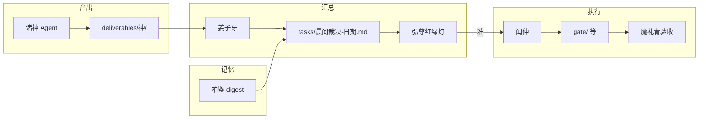

# 防乱机制 · 一页（张良）

> **弘尊 2026-05-20 裁定**：并行无硬顶；**不乱靠流程，不靠限人数**。  
> 本文是 `docs/并行扩神与晨间裁决.md` 第三节的可执行版。姜子牙派活、闻仲动刀前须认此表。

---

## 1. 三条铁律（背下来就够）

| # | 铁律 | 违反时怎么办 |
|---|------|----------------|
| **L1** | **一事一神一工单号** | 重复派活 → 姜子牙合并为一条，旧对话标「已并入工单 #N」 |
| **L2** | **产出只落指定目录** | 散落聊天里的不算交付；须 `deliverables/<神>/` 或 `tasks/闻仲-工单-*.md` |
| **L3** | **动外物须晨间「准」** | push / 改生产 / 花钱 / 危险操作 → 闻仲**不执行**，等 `tasks/弘尊红绿灯.md` |

**已废止**：「同时在线 ≤4 神」硬 cap。殿址机同时开 2～3 个 Cursor 窗口是**机子与注意力**建议，不是诸神编制上限。

---

## 2. 谁有权做什么（防抢活、防混线）



| 角色 | 可做 | 不可做 |
|------|------|--------|
| **诸神专 Agent** | 本神域草稿、标【X交付】 | 替别神改 `gate/`；未批就 push |
| **姜子牙** | 派单、汇总晨读、代笔 bootstrap（须标待神确认） | 长期代写比干/吴道子；越过红绿灯执行 |
| **弘尊** | 准 / 续议 / 否 | 不必自写代码、不必自 push |
| **闻仲** | 执行已「准」项 | 猜弘尊意图；无工单号开工 |
| **魔礼青** | 有证据才判过 | 统筹、册封、无证据放行 |
| **柏鉴** | 摘要、索引、举证挂机 | 替魔礼青验收 |

---

## 3. 依赖链（防三神改同一文件）

**门 v2 及同类「文案→视觉→代码」** 必须链式，不可三神并行改 `gate/`：

```
比干文案【准】 → 吴道子视觉【准】 → 闻仲改 gate → 魔礼青验 T00x
```

| 阶段 | 可并行 | 禁止 |
|------|--------|------|
| 定稿前 | 比干 ∥ 吴道子（各写各的 deliverables） | 闻仲改 gate |
| 定稿后 | 闻仲单批；魔礼青可叠验上一批 | 比干/吴道子再改已准稿（除非弘尊「续议」） |

**分析 / 安全 / 瞭望**（金灵圣母、吕岳、墨子）与门 v2 **无文件冲突**，可与 B1 错开日并行，但**不写入 gate**。

---

## 4. 工单号与对账（防重复派、防翻不到）

1. **总表**：`tasks/诸神并行工单.md`（姜子牙维护状态列）  
2. **批阅台**：`tasks/弘尊红绿灯.md`（**唯一**准/续议/否来源；对话里口头批不算数）  
3. **晨读**：`tasks/晨间裁决-YYYY-MM-DD.md`（柏鉴 digest + 姜子牙补）  
4. **执行单**：闻仲开工用 `tasks/闻仲-工单-<简述>.md` 或晨间表序号  

**命名**：交付文首一行 `【比干交付】` 等；bootstrap 代笔须含 `待神确认`。

---

## 5. 混线急救（发现乱了立刻做）

| 症状 | 处置 |
|------|------|
| 两神改同一文件 | 停写；姜子牙指定**保留神**，另一神产出挪 deliverables 备查 |
| 对话里批了、红绿灯没勾 | 弘尊补勾红绿灯 → 再说「红绿灯已更新」 |
| 不知道谁在做哪条 | 查 `诸神并行工单.md`；缺则姜子牙 10 分钟内补一行 |
| 姜子牙代笔与专 Agent 冲突 | **以专 Agent【X交付】为准**；代笔降格为草稿 |
| 夜间想续跑 | 优先 Cursor Cloud Agent（另议）；**不要**空开桌面 9 窗 |

---

## 6. 与排班的关系

- **批次**（`deliverables/张良/排班与批次.md`）：何时开哪批、几窗、何时关殿址机  
- **防乱**（本文）：不论开几神，**流程**不变  

并行可以很多；**乱**只有一种定义：同一事多神无工单、或未经「准」动外物。

---

*神可以多，流程不能散。*
