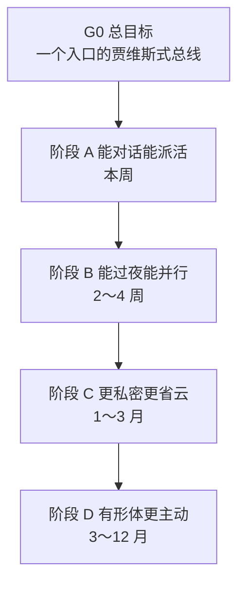

# 规划 · 姜子牙 = 贾维斯 · 可落地总图

> **弘尊要求**：先有大目标表 → 逐层拆解 → 每阶段谁做、交付标准、钱/时间/办法说清楚。  
> **本文 = 主规划文件**；日常只看 [`tasks/弘尊-P0今日.md`](../tasks/弘尊-P0今日.md)，战略看 [`弘尊七事-战略与优先级.md`](弘尊七事-战略与优先级.md)。

---

## 〇-a、v1 弘尊独享（裁定 B · 2026-05-23 · 优先读）

**现行主文档**：[`贾维斯-v1-弘尊独享.md`](贾维斯-v1-弘尊独享.md)

| 以前默认（已降级） | v1 现行 |
|--------------------|---------|
| 弘尊开闻仲/金灵/赵公明等 **Cursor 专窗** | **冻结**对弘尊界面；活由**本条姜子牙**当轮执行（终端、改文件、工单） |
| 复制 `诸神-立即落实` **手贴派单** | 姜子牙内部派活；弘尊只听榜、只裁决 |
| 「一派工一专窗」当日常 | 仓库内诸神资料**保留**；弘尊 **单入口** = 本条对话 |
| 殿址机「睡前点 3 次 New Agent」 | 可选后台能力；**不**再作为对弘尊默认操作 |

**弘尊**：碳基清单（裁决、付款、登录外站、露脸、开户等）。**贾维斯**：其余全办。  
**部署**：v1 本地或云均可；**路线图仍写：未来一定本地部署**（见 v1 主文档 §四）。  
下文阶段表、多窗难点仍作档案；与 v1 冲突时 **以 v1 独享为准**。

---

## 〇-b、弘尊裁定（重要）· 贾维斯 ≠ 第二个闫滨

| 误区（以前容易讲歪） | 弘尊要的 |
|----------------------|----------|
| 「独立 AI」= 学你说话、像你思考的数字分身 | **另一个存在**：有**自己**脾气与判断方式的 **姜子牙/贾维斯** |
| 微调你的聊天记录 → 更像你 | **不要**；人格锚定在 [`docs/agents/姜子牙.md`](agents/姜子牙.md)，**不像弘尊才对** |
| 灵魂 = 复制碳基 | 灵魂 = **现实中站得住的 AI**：能记项目、能派诸神、能提醒、有灯/壳，**服弘尊但不冒充弘尊** |

**对照（头号玩家 / 钢铁侠）**：

- **弘尊** = 托尼（老板、终审、出钱出方向）  
- **姜子牙/贾维斯** = 贾维斯（幕僚长：**冷静、有条理、会顶嘴、会汇报**；不是托尼的克隆体）  
- **诸神** = 专才团队（比干、闻仲…）  
- **首星/壳** = 实验室里的实体存在感（灯亮 = 它在场）

**「现实生活中的真 AI」在本项目里指什么（可验收）**：

1. **独立人格**：固定神位提示词 + 稳定口吻（姜子牙），而非模仿闫滨。  
2. **连续在场**：记得**封神项目**的裁定与待办（卷宗），不是记得「如何扮演闫滨」。  
3. **能动手**：派单、读语音收件箱、维护 P0、催验收（白名单内）。  
4. **物理锚**：Pi 灯、将来铭牌/屏 —— 碳基信任的是**看得见**，不是「另一个我」。  

**实现上因此排除**：

- ❌ 以「像弘尊」为目标的语料微调  
- ❌ 访客进门看到「闫滨视角」的文案（门 v2 已改为来访者向）

**实现上优先**：

- ✅ 姜子牙人格卷宗 + 开卷/封卷 + 诸神分工  
- ✅ 语音：**弘尊说** → **姜子牙听、答、派活**（答话是姜子牙，不是复述弘尊）  
- ✅ 阶段 D：可选 **固定声线 TTS**（与弘尊声线区分）、立绘是**姜子牙**不是弘尊照片  

**贵档真 AI 采购位（三档钱买什么）**：见 **[贾维斯-贵档真AI方案-v1.md](贾维斯-贵档真AI方案-v1.md)**（弘尊 2026-05-22 令）。

**「真·独立 AI 个体」贵不贵？—— 在「贾维斯」定义下重新算**：

| 你要的 | 是否必须训「像你的模型」 | 更便宜的正路 |
|--------|--------------------------|--------------|
| 不像你的独立幕僚 | **不必** | 神位提示词 + 记忆 + 工具链 |
| 现实中有存在感 | 不必 | 灯、壳、推送、语音回复 |
| 比我现在更「一直在」 | 部分要钱（24h 机、订阅） | 殿址机 + cron + 睡前并行 |
| 智商超过当前云模型 | 贵且非必须 | 继续用强模型当姜子牙「脑」，诸神分工 |

---

## 〇、一张图（阶段依赖）



---

## 一、总体目标表（L0 · 什么叫「做成了」）

| 目标编号 | 总体目标（弘尊可验收的一句话） | 成功长什么样 | 计划完成 |
|----------|-------------------------------|--------------|----------|
| **G0** | 弘尊只对一个**有独立人格**的「姜子牙/贾维斯」说话，就能派活、批阅、推进项目 | 它是**幕僚**，不是第二个闫滨；语音或 Cursor 二选一 | 阶段 A 末 |
| **G1** | 姜子牙**记得住**昨天裁定，开卷 3 分钟接上 | `kaijuan` + 晨间裁决 + 柏鉴摘要 | A 进行中 |
| **G2** | 姜子牙**不代敲代码**，诸神交付可验收 | 工单→deliverables→红绿灯→闻仲 | A 末 / B 巩固 |
| **G3** | 弘尊**嘴说决策**即可，不必盯屏打字 | 常听 + 收件箱 + 听音 | 阶段 A |
| **G4** | 弘尊不在时诸神**仍能出草稿** | 殿址机 Agent + 晨间有稿 | 阶段 B |
| **G5** | 核心卷宗**私有化**（不依赖「只在云端」） | Git 在本机/殿址机；敏感卷不进公网 | B～C |
| **G6** | 有**看得见的实体锚**（碳基信任） | 灯 G0 稳；G1 壳/铭牌可选 | B～D |
| **G7** | 姜子牙能**主动提醒 P0**（不是摆设） | 手机 PushPlus 只推 P0 摘要 | B |

**当前整体进度（2026-05-20）**：G1/G2/G3 约 **40%**；G4 **20%**；G5 **50%**（Git 已有）；G6 **30%**（灯有，壳未采）；G7 **10%**。

---

## 二、能力拆解（L1 · 贾维斯 = 七块积木）

| 积木 | 含义 | 对应目标 |
|------|------|----------|
| B1 唯一入口 | 弘尊 → 本对话 / 语音收件箱 | G0 |
| B2 记忆连续 | 日卷、开卷、索引 | G1 |
| B3 派活总线 | 工单、诸神 Agent、不代写交付 | G2 |
| B4 语音通道 | 说 → 记 → 听音执行 | G3 |
| B5 过夜产能 | 殿址机 + cron +（可选）Background Agent | G4 |
| B6 私有锚点 | 本机仓、密钥、本地模型可选 | G5 |
| B7 实体与主动 | 灯/壳、P0 推送 | G6、G7 |

---

## 三、难点 × 怎么搞定（钱 / 时间 / 办法 / 现在能不能干）

> **原则**：每条必须能落到「钱、时间、或现成办法」至少一个；否则标 **暂不做**。

| 难点 | 花钱能搞定吗？ | 花时间能搞定吗？ | 不花钱的办法 | 现在能不能干 | 谁来干 |
|------|----------------|------------------|--------------|--------------|--------|
| **只在云端、不具体** | 部分：殿址机常开、Cursor Pro/Background Agent（已有台式机则主要是电费+订阅） | 能：2～4 周把「过夜出稿」跑顺 | 软件境用 **门+灵台 Pages** 作「脸」；硬件境用 **灯** 作「在场」 | **能（一半）** | 弘尊：殿址机常开；闻仲：cron；姜子牙：工单 |
| **不私有** | 部分：本地 Ollama / 私有 NAS（海康智存已规划）；不必一上来建核战数据中心 | 能：1～3 月逐步把敏感卷迁私有仓或加密 | **现在**：核心在 **本机 Git**；`.env` 不进库；盈利稿试水 **保密** | **能（一半）** | 吕岳：密钥清单；闻仲：私有仓策略；弘尊：批「什么能开源」 |
| **无连续记忆** | 不能单靠钱；fine-tune 贵且非必需 | **能**：每日开卷/封卷纪律 + 柏鉴脚本 | `memories/`、`kaijuan.md`、晨间裁决 | **能** | 姜子牙封卷；柏鉴 `bailian_digest.py`；弘尊：封卷前 1 分钟 |
| **多窗口混线** | 不能 | v1 已 **单入口**（见 v1 独享） | ~~一派工一专窗~~（**降级**）；弘尊不默认开诸神窗 | **能（v1）** | 本条姜子牙执行；诸神=仓库内标签 |
| **姜子牙成摆设** | 推送通道已有 PushPlus（配 token 即可） | **能**：每日 `弘尊-P0今日.md` | 弘尊只批 P0；姜子牙每晚更新 P0 | **能** | 闻仲：扩 `push_traffic_light`；姜子牙：维护 P0 |
| **眼手瓶颈** | 可选：更好麦克风（百元级） | **能**：1～2 天试通 | 已有 `voice_listen` / 桌面「说一句话」 | **能** | 弘尊：开麦试；闻仲：修脚本故障 |
| **诸神空转** | 不能靠钱买「自动诸神」 | v1：**本条贾维斯**写稿/改 `deliverables/` | 比干/吴道子等工单由姜子牙当轮推进；**不要求弘尊开 Agent** | **能（v1）** | 姜子牙本窗 + `诸神并行工单.md`；殿址机 Agent **可选** |
| **真·独立 AI 个体**（**贾维斯人格**，非弘尊分身） | 不必为「像你」微调；24h 托管 **¥500～3000/月** 级可选 | 阶段 B～D 叠实体与自动化 | **神位+项目记忆+灯+派活** = 正路；训模型只提升「脑」，不复制人 | **能（人格面）**；实体在 B～D | 姜子牙卷宗；闻仲自动化；鲁班实体 |
| **24h 无人点 Agent** | Cursor Background Agents（若账号有） | cron + 本窗脚本（`jike_watch` 等） | ~~睡前开 3 窗~~（**降级**）；弘尊不默认手点 | **能（v1 脚本优先）** | 姜子牙本窗跑终端；殿址机 cron 可选 |

**结论（现在能不能干）**：

- **能立刻干（不花大钱）**：B1～B4、B2 记忆、B3 派活制度、B6 一半（Git 私有）、B7 推送试通。  
- **要花时间和殿址机**：B5 过夜产能、B4 全自动 Agent。  
- **要花钱但可控**：鲁班 G1 壳（约百元～数百）、麦克风、Cursor 订阅（若未订）。  
- **暂不作为阶段 A 阻塞**：真·独立模型个体、核战级数据中心。

---

## 四、阶段规划总表（L2）

| 阶段 | 周期 | 阶段目标 | 弘尊投入 | 预估花钱 |
|------|------|----------|----------|----------|
| **A** | 本周 | 入口合一、语音试通、P0 制度、门 v2 收尾 | 每天 ≤30 分钟 + 试麦 | ≈0（已有设备） |
| **B** | 2～4 周 | 殿址机过夜草稿、P0 手机推、闻仲合入 gate、魔礼青验收 | 晨间 10 分钟批阅 | PushPlus 0；电费 |
| **C** | 1～3 月 | 盈利试水（保密）、本地模型试验、私有卷策略 | 批 8～9、定收款 | 可选 NAS/本地盘 |
| **D** | 3～12 月 | 实体壳、绿洲 O1 小场景、更强主动提醒 | 批硬件/视觉 | 鲁班 G1～G2 预算 |

---

## 五、阶段 A · 任务分解（L3 · 本周可勾选）

| 任务 ID | 做什么 | 谁来做 | 交付物 | 验收标准（交付标准） | 钱 | 时间 |
|---------|--------|--------|--------|----------------------|-----|------|
| A1 | 弘尊只认本对话为贾维斯入口 | 姜子牙 + 弘尊 | 本文 + `对着谁说.md` | 弘尊 7 日内无「该问谁」类问题 | 0 | 0 |
| A2 | 语音说一句话 → 收件箱 → 听音 | 弘尊试；闻仲修 bug | `inbox/弘尊语音收件箱.md` 有新条 | 说 1 句 → 本对话「听音」→ 姜子牙复述并派单 | 0 | 弘尊 15min |
| A3 | 维护 `弘尊-P0今日.md` 仅 3～4 条 | 姜子牙 | 每日更新的 P0 文件 | 弘尊打开只看见 P0，无长文堆砌 | 0 | 每日 5min |
| A4 | 比干改门文案 1（退回） | 比干 Agent | `deliverables/比干/门v2文案.md` | 弘尊批阅台 **1 准** | 0 | 1～2 天 |
| A5 | 赵公明/范蠡白话盈利稿 | 两神 Agent | `盈利想法-白话版.md`、`怎么赚钱-说人话.md` | 弘尊读一遍能懂、能续议 | 0 | 1～2 天 |
| A6 | 录入弘尊已批 2～7 红绿灯 | 姜子牙 | `弘尊红绿灯.md` | 闻仲工单可引用 | 0 | 已做 |
| A7 | 闻仲预备合入（等 A4） | 闻仲 | `gate/` PR 或 commit | 魔礼青 T009 证据通过 | 0 | A4 后 1 日 |

**阶段 A 完成标志**：A2✅ + A4✅ + P0 机制跑满 7 天。

---

## 六、阶段 B · 任务分解（L3 · 2～4 周）

| 任务 ID | 做什么 | 谁来做 | 交付物 | 验收标准 | 钱 | 时间 |
|---------|--------|--------|--------|----------|-----|------|
| B1 | 殿址机 cron 柏鉴晨读 | 闻仲 | crontab 截图 + 晨间 md | 每天 6:00 自动生成 `晨间裁决-日期.md` | 0 | 闻仲 2h |
| B2 | 睡前并行 SOP | 姜子牙 | `docs/殿址机-睡前并行SOP.md` | 弘尊离开前 15min 能启动 3 神出稿 | 0 | 1 天写清 |
| B3 | P0 推手机（仅摘要） | 闻仲 | `push_p0.py` 或扩展现脚本 | 手机收 1 条，≤5 行，链到 P0 页 | 0 | 弘尊说「准上 P0 推送」后 2 日 |
| B4 | gate v2 上线 | 闻仲 | Pages `gate/` | 魔礼青验收勾选 | 0 | A4 后 |
| B5 | 鲁班 G0 灯自启验收 | 鲁班+魔礼青 | `rgb_breath.service` 证据 | 重启 Pi 仍呼吸 | 0 | 半日 |
| B6 | 金灵圣母+吕岳首单 | 两神 | `deliverables/金灵圣母/` `吕岳/` | 各 1 页可执行清单 | 0 | 各 1 天 |

**阶段 B 完成标志**：晨间有稿 + 门 v2 上线 + P0 推送试通 7 天。

---

## 七、阶段 C · 任务分解（L3 · 1～3 月）

| 任务 ID | 做什么 | 谁来做 | 交付物 | 验收标准 | 钱 | 时间 |
|---------|--------|--------|--------|----------|-----|------|
| C1 | 盈利小范围试水（保密） | 赵公明+范蠡+弘尊 | 收款 1 笔或 5 个意向 | 不违反保密红线；弘尊准 | 渠道费 | 4 周 |
| C2 | 殿址机 Ollama 7B 试接 | 闻仲+鲁班 | 文档：能否接姜子牙草稿 | 本地能答开卷 3 问 | 0（有 3070） | 2 周探路 |
| C3 | 私有卷策略 v1 | 吕岳 | `docs/私有卷与开源边界.md` | 诸神知晓何者不可 push 公网 | 0 | 1 周 |
| C4 | 备份海康/树莓派 | 闻仲 | 脚本 + 试恢复 | 魔礼青抽测 1 次恢复 | 已有盘 0 | 2 周 |

---

## 八、阶段 D · 任务分解（L3 · 3～12 月 · 纲要）

| 任务 ID | 做什么 | 谁来做 | 交付物 | 验收标准 | 钱 | 时间 |
|---------|--------|--------|--------|----------|-----|------|
| D1 | 硬件 G1 壳/铭牌 | 鲁班+弘尊批 | 实物照片 | 弘尊桌上可见 | 90～230¥ | 采购后 2 周 |
| D2 | 绿洲 O1 单场景 | 吴道子+闻仲 | 可访问 URL | 弘尊 walking 3 分钟 | 美术时间 | 2～3 月 |
| D3 | Cursor CLI 无人值守（若可行） | 闻仲 | PoC 日志 | 夜间 1 工单自动跑完 | 订阅 | 研究型 |

---

## 九、谁来做 · 总分工（不变）

| 角色 | 负责 |
|------|------|
| **弘尊** | 只批 P0/红绿灯；试语音；不代敲代码 |
| **姜子牙（本对话）** | 总规划、P0 队列、派单、读语音、封卷 |
| **闻仲** | 脚本、cron、push、gate 合入、殿址机 |
| **魔礼青** | 验收证据 |
| **比干/吴道子** | 门与视觉稿 |
| **赵公明/范蠡** | 盈利白话与试水 |
| **鲁班** | 硬件 |
| **张良** | 排班与阶段表维护（可授权更新本文阶段表） |
| **柏鉴** | 晨读摘要程序 |
| **吕岳** | 密钥与私有边界 |
| **殿址机** | 常开、cron、挂 Agent |

---

## 十、与「今早七事」对照

| 七事 | 本规划阶段 |
|------|------------|
| 1 贾维斯合体 | 全文 G0～G7，阶段 A～D |
| 2 软硬件 | B5、D1；门在 B4 |
| 3 盈利 | A5、C1 |
| 4 诸神并行 | A7、B2、B6 |
| 5 绿洲 | D2 |
| 6 公司化 | B1～B3、制度文件 |
| 7 语音 | A2 |

---

## 十一、文件索引（规划体系）

```
v1 弘尊独享（优先）→ docs/贾维斯-v1-弘尊独享.md
L0 总目标     → 本文 §一
L1 能力积木   → 本文 §二
难点解法矩阵   → 本文 §三
L2 阶段       → 本文 §四
L3 任务+验收   → 本文 §五～§八
每日执行       → tasks/弘尊-P0今日.md
战术红绿灯     → tasks/弘尊红绿灯.md
门/硬件七事    → tasks/弘尊七事-分阶段规划.md
贵档真 AI 三档 → docs/贾维斯-贵档真AI方案-v1.md
```

**下一步（姜子牙）**：按 A 表逐项勾；A2、A4、A5 未勾前，不扩新口号。

**弘尊裁定**：**规划准** · 同意先干边改 · 2026-05-20。

*规划卷 v1.1 · 姜子牙按 A 表执行；改日期/改预算弘尊一句即可*
