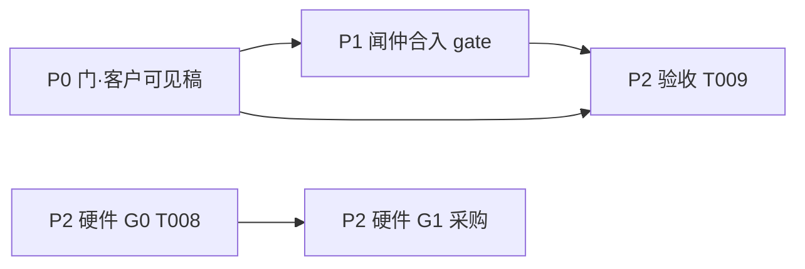

# 弘尊七事 · 分阶段规划（姜子牙 · 2026-05-20）

> **弘尊裁定**：先规划 → 分阶段 → 逐层分解到可执行 → **责任人 / 时间 / 验收标准** → 再交付。  
> **「七事」** = 红绿灯 **1～7**（门 v2 合入线 + 鲁班硬件线）；**8～9**（盈利）并行，不挡门。

---

## 总判断：该不该这样干？

**应该。** 此前诸神「交稿即完工」、弘尊「看榜即卡点」，缺中间层：

| 层级 | 以前 | 现在起 |
|------|------|--------|
| 战略 | 口头 / 记忆卷 | 本表 + `弘尊红绿灯.md` |
| 阶段 | 无 | P0 门对客户 · P1 合入 · P2 硬件 |
| 工单 | 粗 | `tasks/<神>-工单-*.md` 可验收条目 |
| 交付 | `deliverables/` | 仍用，但须标 **受众**（客户 / 诸神 / 闻仲落码） |
| 动生产 | 混在「看过」 | **仅「准」+ 闻仲工单** |

弘尊仍只批 **准 / 续议 / 否**；姜子牙负责把七事拆到诸神日程，不让你填表。

---

## 阶段总览

| 阶段 | 目标 | 弘尊决策点 | 最早完成 |
|------|------|------------|----------|
| **P0** | 门 v2 文案/画面/故事 **面向来访者** 定稿 | 批 1～4 **准** | 比干吴道子改完即呈 |
| **P1** | 闻仲写入 `gate/` 并 push Pages | 批 6 **准**（隐含 1～3 已准） | P0 准后 1 工作日 |
| **P2a** | 魔礼青 T009 证据验收 | 批 5 **准** | P1 部署后 |
| **P2b** | 鲁班 G0 灯自启 / G1 采购 | 批 7 **准**（G1 含花钱） | 与 P1 可并行 |

**8～9 盈利**：赵公明/范蠡已交稿 → 候弘尊续议变 **准** → 本周三件事，**不挡** P0～P2。

---

## 七事分解（可执行层）

### 事 1 · 门第二版文案（比干）

| 字段 | 内容 |
|------|------|
| **责任人** | 比干 主笔 · 姜子牙 受众裁定 · 闻仲 落码 |
| **截止** | P0：2026-05-22 弘尊过目；P1：准后 +1 日闻仲合入 |
| **验收标准** | ① 文首标 **受众=来访者**；② 无「灵台记史」「诸神当值」「Cursor/tasks」；③ 与 `门v2风格板` 元素一一对应；④ 弘尊批阅台 **准** |
| **当前** | v2 稿偏「诸神/internal」→ **改稿中**（见 `deliverables/比干/门v2文案.md`） |

### 事 2 · 入门故事（比干）

| 字段 | 内容 |
|------|------|
| **责任人** | 比干 |
| **截止** | 同事 1 |
| **验收标准** | 来访者第一人称或旁观叙事；结尾可留「维护者」一句，正文不写红绿灯/殿址机 |
| **当前** | 旧稿立境者 POV → **改稿中** |

### 事 3 · 门第二版画面（吴道子）

| 字段 | 内容 |
|------|------|
| **责任人** | 吴道子 · 闻仲 实现 CSS |
| **截止** | 同事 1 |
| **验收标准** | 风格板含门外/门内/动效时长；手机 390px 可读；弘尊 **准** |
| **当前** | 风格板 ✅ · 待受众对齐后 v2.1 微调 |

### 事 4 · 四神立绘（吴道子）

| 字段 | 内容 |
|------|------|
| **责任人** | 吴道子 · 闻仲 换 SVG |
| **截止** | P1 合入时或 P1+1 日 |
| **验收标准** | 四卡 SVG 或占位规范；与事 3 同色 token |
| **当前** | 方案 ✅ · 可先做 **客户向** 神卡一句（比干联动） |

### 事 5 · 门线上验收 T009（魔礼青）

| 字段 | 内容 |
|------|------|
| **责任人** | 魔礼青 验 · 闻仲 修 |
| **截止** | P1 部署后 半日 |
| **验收标准** | `tasks/魔礼青验收.md` 清单全勾 + 截图/链接证据 |
| **依赖** | P1 上线后 |

### 事 6 · 闻仲合入 gate（闻仲）

| 字段 | 内容 |
|------|------|
| **责任人** | 闻仲 |
| **截止** | 弘尊对 1～3 **准** 后 24h 内 |
| **验收标准** | `gate/index.html` 与准稿一致；Pages 可开；魔礼青待验 |
| **依赖** | **弘尊 1～3 准**（硬门禁） |

### 事 7 · 鲁班硬件 H1+H5（鲁班）

| 字段 | 内容 |
|------|------|
| **责任人** | 鲁班 方案 · 闻仲 G0 脚本 · 弘尊 G1 采购批 |
| **截止** | G0：本周；G1：弘尊 **准** 后下单 |
| **验收标准** | G0：`rgb_breath.service` 重启仍呼吸；G1：采购清单与预算一致 |
| **依赖** | G0 不等门；G1 等弘尊 **7 准** |

---

## 诸神现在在干嘛？闲着还是等红绿灯？

| 状态 | 神 | 说明 |
|------|-----|------|
| **稿已交，等弘尊** | 比干、吴道子、赵公明、范蠡、鲁班、张良 | 不是没事，是 **P0 出口在弘尊**；未「准」前闻仲 **不得** 改 `gate/` |
| **可立刻续干（不等准）** | 比干、吴道子 | **门 v2.1 客户向改稿**（本规划 P0）；神卡来访者版一句 |
| **可立刻续干** | 金灵圣母、吕岳、墨子 | 工单在 `诸神并行工单.md`，**从未开 Agent** → 姜子牙可派 |
| **等 P0 准** | 闻仲 | 合入 gate（事 6） |
| **等 P1 部署** | 魔礼青 | T009（事 5） |
| **总线** | 姜子牙 | 本规划、派单、晨间裁决；**不**代写客户向正文 |

**结论**：不是全员闲着；是 **「动生产」统一等红绿灯**，**「动稿子/清单/方案」** 应继续。比干、吴道子 **不应空转**——受众改稿即下一工单。

---

## 门 v2 受众（弘尊 2026-05-20 裁定）

| 对象 | 用途 | 内容原则 |
|------|------|----------|
| **来访者（客户）** | `gate/` 线上之门 | 影院式入境；神名录 **典故/气质**；**不写** 灵台记史、当值、Cursor、tasks、柏鉴落字 |
| **诸神** | `deliverables/` 内 **内部参阅** 或 Agent 开卷 | 可写分工、闻仲落点、验收铁律 |
| **弘尊** | 批阅灵台 + 红绿灯 | 准/续议/否；不必读 WPS 全文 |

比干已按 **来访者** 改 `门v2文案.md`、`入门故事.md`；旧 internal 句见各文件底「诸神参阅」节。

---

## 弘尊本周最小动作

1. **10 分钟**：批阅灵台对 **改后的 1～2** 点「同意/退回」→ 说 `1、2 准` 或续议一句。  
2. **可选**：`3、4 准` 或续议。  
3. **8～9**：`8、9 准，¥49，收款用×××` 或续议。  
4. **7**：`7 准 G0 先验` / `7 续议：…`  

姜子牙收到准后：开闻仲工单、更新 `弘尊红绿灯.md`、派金灵圣母/吕岳（若弘尊点头扩并行）。

---

*与 [弘尊红绿灯.md](弘尊红绿灯.md) · [诸神并行工单.md](诸神并行工单.md) 同步。*
